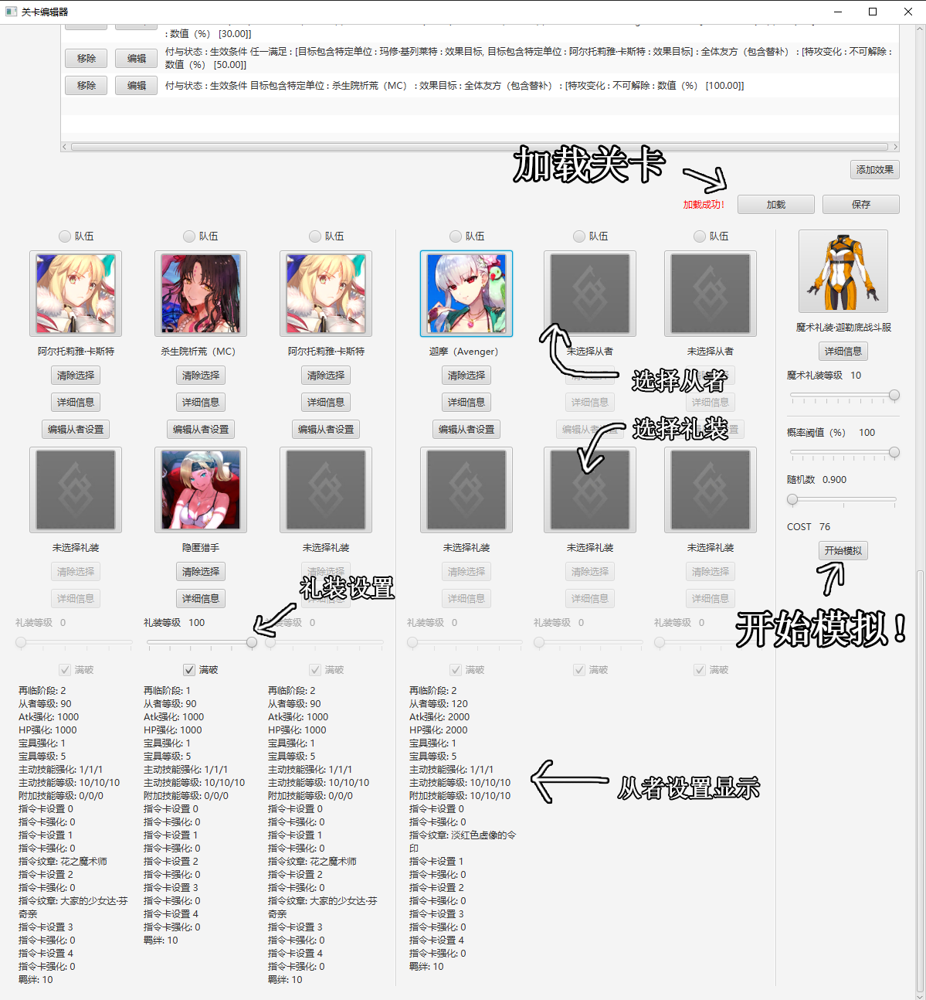
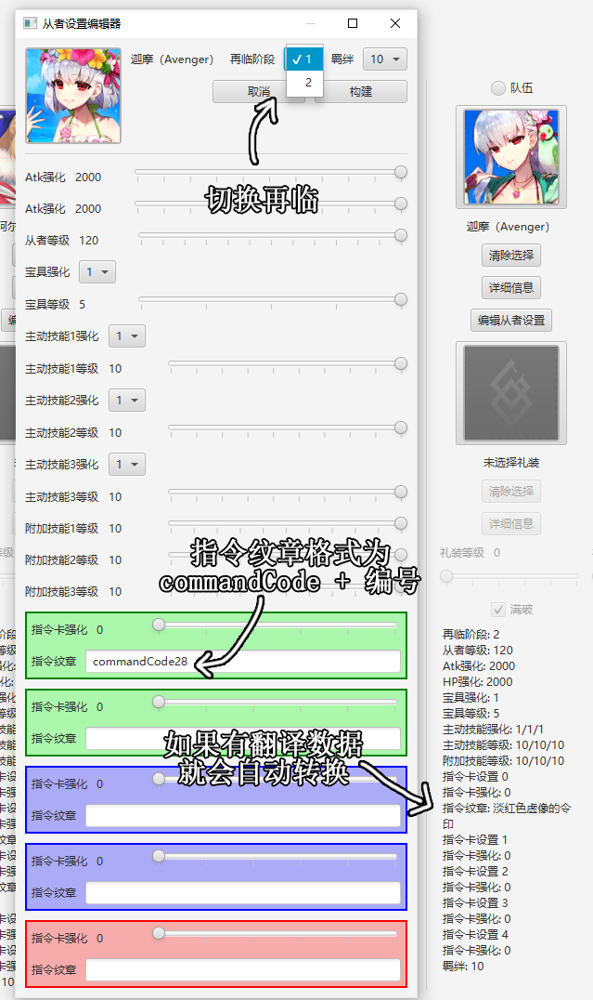
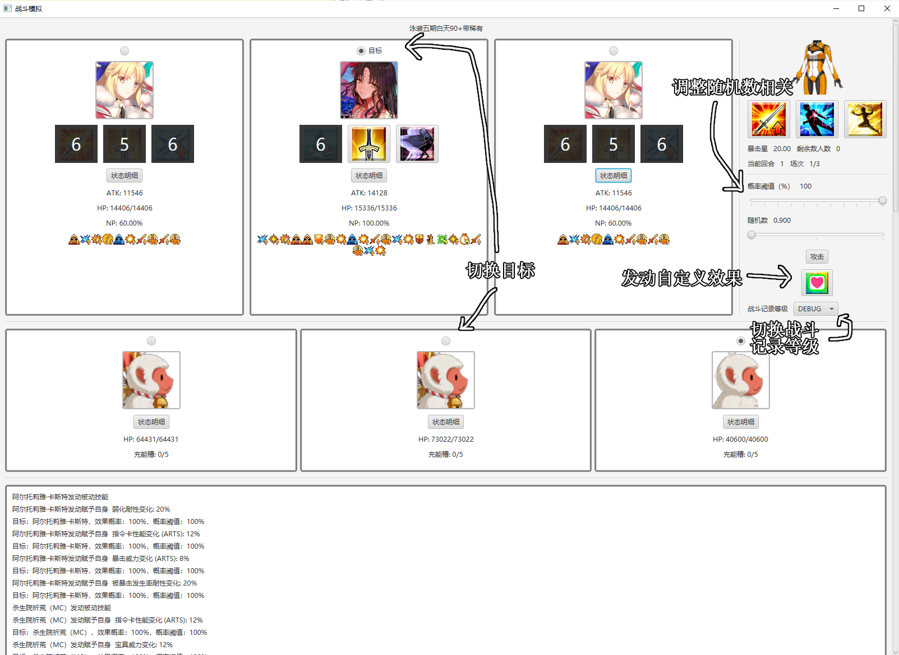
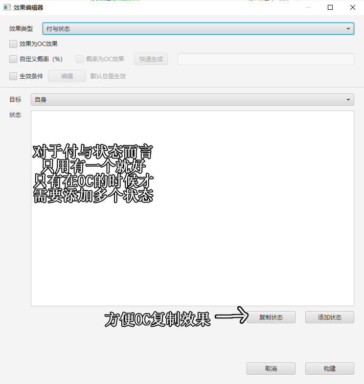
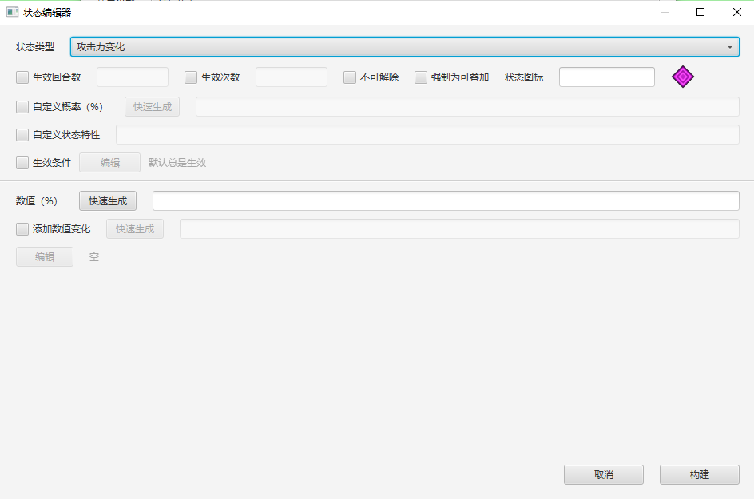

# FGO模拟器

制作自定义单位时，请主要依照FGO的逻辑来写。
虽然可以写出FGO没有的从者、礼装，但是除非符合逻辑否则程序会做什么我也不知道。

另外这个小程序没有任何联网功能，我也不准备录入所有东西的数据，所以请自己制作需要的部件~

未来大概就只在github随缘更新，但是现有的制作器基本支持写出绝大部分东西了。

目前支持的操作：

- [战斗模拟](#战斗模拟)
- [从者制作](#从者制作)
- [礼装制作](#礼装制作)
- [关卡制作](#关卡制作)
- [敌方单位制作](#敌方单位制作)
- [指令纹章制作](#指令纹章制作)
- [魔术礼装制作](#魔术礼装制作)

## 运行
我用Java15（corretto 15.0.2）写的，所以应该装个Java15以上就能跑？

主程序在`Program`文件夹下，请不要随意挪到别的文件夹！另外`CommandCodes`, `CraftEssences`, `Enemies`, `Icons`, `Levels`, `MysticCodes`, `Servants`, 
`Translations`文件夹及各种默认图片也请不要随意乱动。

另外是支持多语言的，在`Translations`文件夹下加就好。首选的语言可以在`options.ini`里设置。

## 更新相关
- v0.62.beta:
  - 系统：
    - 修复了从者设置界面HP强化显示为ATK强化的Bug
    - 七周年战斗更新（Quick Chain20星，三色Chain）
    - 添加特性虞美人
    - 添加战斗步骤中的撤回功能
- v0.61.beta:
  - 系统：
    - 修复了目标选择文字的Bug
    - 现在可以点击从者头像选择指向性技能目标和换人
  - 机制相关
    - 宝具封印时敌方不再增加充能
    - 修复了延长攻击技能回合（巴姐被动）会导致敌方Buff（巴姐站对面）过早消除的问题
  - Buff相关
    - 添加了HP回复量提供提升Buff，与HP回复量提升Buff乘算（已验证）
- v0.60.beta:
  - 系统：
    - 修复了稀有度检查不为整数的Bug
    - 更新了截止到BB圣杯战线的所有从者
  - 机制相关
    - 付与Buff现在会固定检测效果对象是否还存活（HP>0）
    - 修正了复仇的怨念默认为Debuff的Bug
    - 修正了无法行动状态下指令卡连携、宝具连携的判断（Credit：NGA用户InsufficientFunds，aikawaJunCY）
- v0.53.beta:
  - 系统：
    - 限制了战斗中详细状态显示单个状态的长度，不会再导致看不见回合数
    - 职阶相性Buff显示优化
    - 修复了0%即死率的敌人不被正确读取的Bug
    - 限制了战斗模拟界面初始的最大宽度
  - 机制相关
    - 修复了效果发动类Buff无法正确检测效果发动者相关条件的Bug
    - 扩大了攻击者的检测范围，主要用于在战败退场时效果可以指向攻击者
    - 现在场次效果优先于入场，主要用于正确给敌方上登场效果
    - 修复了敌方充能不会归零的Bug
- v0.52.beta:
  - 机制相关
    - 修复了宝具伤害不检测职阶相性Buff的Bug
  - Buff相关
    - 职阶相性Buff现在会正确检测条件（Beast IV人科、兽科用）
- v0.51.1.beta:
  - 现在所有文件都会以UTF-8编码进行交互
- v0.51.beta：
  - 系统：
    - 尝试修复翻译文件读取乱码问题，现在会以UTF-8编码读取 
  - 机制相关
    - 修复了会检测防御力变化上限的问题，现在只检查下限（-100%）（Credit：NGA用户1248hks）
  - Buff相关
    - 不可叠加状态检测现在会忽略掉强制为可叠加的同类Buff（大公三技能）（Credit：NGA用户1248hks）
    - 毅力发动顺序调整为优先消耗可解除的最早施加的毅力，直至全部可解除的毅力消耗完了才消耗不可解除的毅力（也是从最早施加的开始消耗）（Credit：NGA用户1248hks）
    - 伤害反弹现在只在受到过伤害才发动，并且无视回避和无敌，也不再消耗防御者的回避和无敌（Credit：NGA用户1248hks）
  - 从者编辑
    - 添加了NP率和出星率的一键生成
  - 关卡编辑
    - 修复敌方从者如果设置了非初始灵基加载时再临切换选项不会选到设置的再临的Bug
    - 优化了敌方从者如果有编辑过基础信息后再切换再临选项的机制，现在会清除编辑过的设置

## 战斗模拟

### 准备界面

调整从者设置请点击编辑从者设置按钮。
同时，点击开始模拟后，队伍中从者、礼装、御主装备的设置将会保存至`userPrefs.json`。
如果队伍中有同名从者/礼装，则保存最右边的从者/礼装的设置，但进入关卡时的设置还是各自的设置，只是保存时会选最右的保存。

另外从者、礼装、御主衣装的详细信息在准备界面不可编辑，以及在本界面加载后会忽略新的变化。
如果在进入该界面后进行了相关的编辑，请重新打开本界面以读取相关变动。

不过在本界面还是可以照常调整关卡设定，相关设置参见[关卡制作](#关卡制作)。

### 编辑从者设置

切换再临时会自动将主动技能/宝具强化设为强化过，如果有特殊需求请手动更改。

附加等级为0则设置为未开放。

指令卡设置显示的是对应的卡色，方便针对不同色卡上不同纹章。

羁绊等级现在暂无实际用途。

### 战斗界面

只要发动了攻击就会进行回合，目前系统没有写撤回所以请慎重操作。
敌方单位不会行动，但是仍会发动正常发动回合结束效果等类似操作。
敌方从者默认为一宝并拥有稀有度不喂圣杯所允许的最大等级的ATK，这点主要是为了正确执行敌方的巴姐反击buff。
另外虽然敌方从者会发动回合结束时获得暴击星的技能，但并不会真正获得暴击星。

指令卡选择界面中点一下为选择，点两下则为暴击，另外会显示指令纹章和指令卡强化。若符合条件，Arts/Quick Chain由无来源发动。
宝具可以在100NP以下时发动，这时OC实际是0，但由于OC最小为1，所以连着发动不满的宝具OC判断会是1，1，2而不是正常的1，2，3。

支持在战斗中发动任意效果，这些效果和御主礼装一样没有发动来源，所以使用时请将目标选择为“目标友方/敌方”、“全体友方/敌方”等合理目标。
若目标设置为不合理目标（自身、效果目标、攻击者等），程序具体会做什么是我也不知道的（Undefined）。效果制作参见[机制讲解](#机制讲解)。

另外目前没有设置任何关卡结束的检查，所以即使敌方或我方全灭了仍可发动技能，当然此时具体会做什么也是不明确的。

## 机制讲解
为了能够制作合乎逻辑的从者，首先得介绍一下模拟器的工作原理。对理解能力有自信的可以直接看做完的从者当参考。

### 目标
一个合理的从者需要有合理的技能来发动合理的效果，而效果可能有条件判断，所以最主要的就是目标的选择得正确。
注意目标的选择是相对的，也就是说从敌方的角度来讲敌方的全部友方对我方来说就是全体敌方。
模拟中使用任意效果按钮发动的效果、场次效果、关卡效果是以我方视角为基准的。

战斗中随时合理的目标：

- 目标友方：只要模拟没结束， 模拟器就肯定有一个设定的目标友方。
- 目标敌方：同上。
- 非目标友方
- 非目标敌方
- 全体友方
- 全体友方（包含替补）
- 全体敌方：全体宝具应选取此项为目标。
- 全体敌方（包含替补）
- 首个敌方：从右向左数、从上到下数的第一个敌方单位。
- 最后一个敌方
- 全体角色
- 全体角色（包含替补）

以上目标是随时都合理的，任何以以上为目标的效果和条件判断都应该正确结算。

发动效果后（包括攻击时，因为攻击也算效果）合理的目标：

- 自身： 发动效果的单位。若是战斗中发动的任意效果或是场次效果以自身为目标则不会有任何效果（因为是无来源）。
- 效果目标：如果效果有目标则为合理。由于处理效果时是依次处理，所以如果一个效果有多个目标，可以通过此目标来依次检测每个目标的条件。
- 效果发动者：与自身相同，添加此项只是为了让像绘里濑的对死灵弱耐读起来合理（因为此时需要判断的时效果发动者的条件，写自身像是在指绘里濑）。
- 除自身外全体友方
- 除自身外全体友方（包含替补）
- 除自身外第一个友方
- 除自身外最后一个友方
- 除自身外全体角色
- 除自身外全体角色（包含替补）
- 攻击者：只在处理指令卡和宝具伤害时合理。
- 防御者：同上，注意全体宝具是依次处理伤害的，所以可以通过该目标选取当前处理的单位。

注意以上这些目标中，效果目标、效果发动者、攻击者、防御者主要是用作条件判断。

举例说明，比如“己方全体【龙】特性的友方单位NP改变20%”，此时效果目标为全体友方，而条件判断的目标为效果目标。

### 条件
技能和宝具可以有发动条件，效果和Buff也可以有生效条件，所以专门写了这一类来进行相关的判断。
大部分我觉得都还比较好懂？

`boolean`相关条件：

- 总是满足：默认的条件，相当于`true`
- 从不满足：相当于`false`
- 同时满足：相当于`&&`
- 任一满足：相当于`||`
- 不满足：相当于`!`

战斗相关条件：

- 当前指令卡类型：红放蓝放绿放红爆蓝爆绿爆红耐性蓝耐性绿耐性等等，由于我肯定不会给每种攻击buff都写一个特定色卡所以色卡相关的都需要这个条件才能特定色卡生效。
- 当前指令卡为宝具卡：“不满足：当前指令卡为宝具卡”相当于“当前指令卡为非宝具卡”。
- 当前指令卡为暴击

状态相关条件：主要给付与状态和解除状态时的耐性判断提供条件

- 状态类型
- 状态拥有特性：可以提供自定义特性，但主要用来判断强化、弱化状态。参见[状态](#状态)。这里特性是单选，检测多个特性需要利用同时满足和任一满足。
- 状态可被移除

取对象条件：需要合理的[目标](#目标)。对于目标包含特性的条件，在战斗中从者均会自动添加一个“从者”特性，以及属性、隐藏属性、性别为了方便也会被转为特性。

### 数值变化
部分效果和Buff拥有动态的数值变化，由于把这些逻辑放到效果和Buff里太复杂了我就单独写了一类来表示这些变化。

- 根据状态数量变化：设定的目标中，每个符合条件的状态都会使数值变化。
- 根据特性数量变化：同上，但是针对特性。
- 根据可吸收HP变化：有多少吸多少，但不会致死。注意数值变化本身不会真的吸HP，所以还需要一个补一个效果来实际上吸掉。
- 根据可吸收NP变化：敌方气槽里有气才符合要求，我方则是有多少吸多少。
- 根据回合数变化
- 根据HP变化：HP在最大HP%以上时不会生效，在最大HP%和最小HP%区间逐渐提升，到最小HP%达到最大值。在区间内的具体公式为基础值 + 附加值 * (最大HP% - 当前HP) / (最大HP% - 最小HP%)

### 效果

自定义概率只对付与状态、解除状态、即死、NP改变、充能槽改变生效。若是不勾选则为100。

生效条件目前对宝具伤害不生效。

若是只是想要标记概率为OC效果，不必勾选效果为OC效果。所有OC的勾选中只要勾了任意一个整个效果就会被正确处理。

特殊说明：
- 付与状态：对于付与状态来说，如果数值只是根据等级变化的话，数值变化放在Buff里就好。
这个界面唯一需要添加复数状态就是在OC时，每个OC对应一个状态（具体可参照已有的从者）。
- 解除状态：数值填0以解除所有符合条件的状态。
- 强制解除状态：用于解除不可解除的状态，不过仍然受状态解除耐性影响。
- 充能改变：注意正负数。
- 最大HP改变：专门用于付与最大HP改变的状态，因为付与完状态后还有个HP改变的效果。
- 宝具伤害：宝具伤害只有三个合理的目标：目标敌方、全体敌方、攻击者（来自巴姐宝具）。
特攻条件的目标一般应设定为防御者。
- 吸收状态：目标指的是从哪些单位吸取目标，最后总是吸到自己身上。
- 选择指令卡：对应的状态应该只为指令卡类型变化和宝具指令卡类型变化。同时该效果涉及到特殊的目标选择，参见[特殊目标选择](#特殊目标选择)。
- 换人：参见[特殊目标选择](#特殊目标选择)。
- 随机效果：参见[特殊目标选择](#特殊目标选择)。

### 状态

生效回合数和生效次数都留空则为永久状态。

被动技能和礼装付与的状态不用勾选不可解除，会自动标记为不可解除。

图标不会自动填充，需要手动填写`Icons/Buffs`中的一项（举例`attackUp`）。

状态特性一般而言有以下几类：
- 攻击类状态
- 防御类状态
- 精神类状态
- 强化类状态
- 弱化类状态
- 行动不能类状态（眩晕、魅惑、猪化、睡眠）

一般用来判断强化解除、弱化状态解除的目标，也可以通过添加自定义特性来实现特定状态的解除，可以参考奥伯龙。
数值类的Buff会根据数值的正负来判断强化和弱化状态，Buff本身会自动填充特性，例如攻击力提升30%会自动有攻击类状态和强化类状态的特性。
不过只要添加了任何自定义状态，本身自带的状态特性就会被抹除。
另外，发动效果类的Buff需要手动添加任何特性，因为我没写效果的正负面判断（另外如果要发动多个效果也无法判断）。

特殊说明：

- 暴击发生率、被暴击发生率、受击NP率变化、目标集中度变化：由于敌方不会行动，这些Buff目前没效果。
- 暴击星集中度、无法抽出指令卡、无貌之月、洗牌：由于行动自由选卡，这几项也没效果。
- 无效类：由被强化成功率-1000%和弱化耐性1000%分别实现强化无效和弱化无效。即死无效建议通过把即死耐性拉到10000%来实现。
- 魅惑耐性下降：是精神类状态
- 延迟效果和回合结束效果：延迟效果是经过特定回合数后在敌方回合结束时发动的效果，回合结束效果是在己方回合发动的效果。
- 退场时效果和战败退场时效果：换人算退场，不算战败退场。
- 职阶相性变化：拆成了攻击相性和防御相性，若不设定自定义数值则为1.0。可以填写任意职阶（ANY_CLASS）来针对所有职阶。
- 指令卡类型变化：Hits数也会变，所以需要从者有对应的色卡。
- 宝具指令卡类型变化：宝具倍率以BAQ比率1:1.5:2来转化。
- 技能阶级提升：实际效果为提升技能强化。

## 从者制作

由于附加技能的高度重复性，在`Base Data`文件夹下可以找到准备的两个从者范本，可使用加载功能快速开始。
999适用于非Berserker的从者，1000为Berserker。

### 注意事项：

- 从者编号需要为整数。
- 从者特性请用逗号、顿号隔开。
- 特性可以直接复制Mooncell的数据（注意人型和EA特攻）。因为天地从者可以直接通过条件判断所以我没加天地从者这个特性，
不过要注意亚从者和拟似从者。另外，特性的警告仅是警告，还是可以添加自定义特性的。
- 从者的主动技能、宝具、被动技能、附加技能实际就是发动数个效果。
- 被动技能和附加技能付与的状态不用勾选不可解除，会自动标记为不可解除。
- 添加再临阶段、宝具强化、技能强化均会复制上一个作为模板。
- 虽然支持再临设置，但是如果一个从者多个再临完全一致的话就不是很有添加那些额外再临的必要。
- 宝具类型仅作筛选用，无实际效果，所以实际制作宝具效果时还是要正确选择目标。
- 从者的再临头像格式为`servant<从者编号>_asc<再临阶段>_thumbnail.png`，需保存在`Servants/servant<从者编号>`同一文件夹下。
- 从者名字需填在`Translations/zh_CN.ini`的`Name`部分下，格式为`servant<从者编号>=<名字>`。重启程序才会重新读取翻译文件。
- 从者数据格式为`{"lv":1,"HP":1652,"ATK":1775}, {"lv":2,"HP":1816,"ATK":1943}, ...`。
这部分最好的获得方式是去Mooncell的`从者<从者编号>/成长曲线`的编辑页面摘取，`lv`无实际作用，只是因为这是Mooncell使用的格式（
请不要随意更改Mooncell的资料）。感谢Mooncell！

### 特殊目标选择
如果技能有需要特殊目标选择的效果（换人、选卡色、随机效果），主动技能的发动需要声明并且提供选项。

## 礼装制作
由于礼装的等级数据基本都是一样的，在`Base Data`文件夹下可以找到准备的数据样本，这样制作礼装时不用去Mooncell的编辑页面。

### 注意事项：
- 礼装编号需要为整数。
- 礼装本质为以当前从者为效果发动者的一系列效果，另外在付与状态时不需要勾选不可解除，会自动标记为不可解除。
- 礼装的效果须最多准备两级，分别为未满破，满破的效果，举例获得暴击星15，20，攻击力提升10，15。
- 活动倍卡推荐使用自定义场地特性来判断是否付与倍卡效果，可参考泳5的关卡和隐匿猎手。
- 礼装的头像格式为`craftEssence<礼装编号>_thumbnail.png`，需保存在`CraftEssences/craftEssence<礼装编号>`同一文件夹下。
- 礼装名字需填在`Translations/zh_CN.ini`的`Name`部分下，格式为`craftEssence<礼装编号>=<名字>`。重启程序才会重新读取翻译文件。

## 关卡制作

- 支持同屏三个以上敌人，并无设置上限，也就是说只要同屏幕最大人数填的够高可以一炮99杀。
- 场地特性请用逗号、顿号隔开。另外与从者特性一样可以添加自定义特性以满足需求。
- 支持场次和关卡效果，由无来源在我方视角发动。
- 关卡效果最大用途就是提供活动加成付与，参考泳五的关卡。基本上就是填一次做蓝本然后一直加载。
- 敌人没有添加空位的设置，但是应该不影响。
- 敌人支持多血条，用逗号隔开即可。
- 敌人的基础数据可以随意更改，用于切换小怪职阶、调整从者即死率、添加影从者特性等。
另外请注意，若填写了特性一栏，将会完全忽略掉小怪、从者的本来的特性，而完全依赖于所填写的特性。
不过点编辑之后会自动填充现有的特性，所以只是提醒一下。
- 敌方从者默认为一宝并拥有稀有度不喂圣杯所允许的最大等级的ATK，这点主要是为了正确执行敌方的巴姐反击buff。
- 关卡的分类整理请自行解决，另外关卡名也不支持翻译，俺直接开摆。

## 敌方单位制作

- 任意职阶其实和盾阶一样的克制倍率。另外我猜任意职阶和改变职阶相性Buff有交互错误。
- 特性请用逗号、顿号隔开。另外与从者特性一样可以添加自定义特性以满足需求。
- 敌人的分类也请自行解决，不过敌方单位是支持基于所填写ID的翻译的，在`Translations/zh_CN.ini`的`Name`部分下，格式为`<敌人ID>=<名字>`。重启程序才会重新读取翻译文件。
当然也可以直接填中文ID开摆。

## 指令纹章制作

- 纹章编号必须为整数。
- 纹章本质是一系列打在指令卡上的Buff，所以只有攻击类效果、攻击前后效果才有效。
- 纹章的Buff不会被减少使用次数，没有回合数限制，也不会被任何形式解除，因为我猜纹章的Buff都是永久的所以没写相关的逻辑。
- 纹章的图像格式为`commandCode<纹章编号>.png`，需保存在`CommandCodes/commandCode<纹章编号>`同一文件夹下。
- 纹章名字需填在`Translations/zh_CN.ini`的`Name`部分下，格式为`commandCode<纹章编号>=<名字>`。重启程序才会重新读取翻译文件。

## 魔术礼装制作

- 男女服装图片是必要的，因为我没给准备默认的图片。
格式为`mysticCode<魔术礼装编号>_male.png`和`mysticCode<魔术礼装编号>_female.png`，需保存在`MysticCodes/mysticCode<魔术礼装编号>`同一文件夹下。
- 魔术礼装名字需填在`Translations/zh_CN.ini`的`Name`部分下，格式为`mysticCode<魔术礼装编号>=<名字>`。重启程序才会重新读取翻译文件。
- 魔术礼装编号必须为整数。
- 魔术礼装本质就是三个无来源发动的主动技能。我没给魔术礼装准备强化，希望未来不会需要......

## 已知问题
### BUFF
* 帝王花增殖状态这种复数的可堆叠上限没写
* 无貌之月不会正确解除，这个我懒得写了
* 由于强化无效和弱化无效是用耐性实现的，复数的无效会同时被消耗，推荐使用自定义效果来手动补充

### 效果
* 帕西维尔宝具最后一个回复HP百分比最低的友方的效果未制作
* 解除成功后赋予状态类效果实际为先检测是否有满足要求的可解除状态，实际可能被解除耐性顶掉而不会解除
* 泳装小芬奇等宝具随机效果没做，推荐用自定义效果来手动选择

### 模拟
* 敌方从者（主要为巴姐服务）默认1宝+atk为所在稀有度最大等级的atk
* 巴姐被晕/宝具封印会攻击吗？
* 奥伯龙三技能会不会增幅宝具威力下降？

## 声明
本软件的代码部分由MIT许可证许可使用，开发理念仅为个人使用。软件所涉及的公司名称、商标、产品等均为其各自所有者的资产，仅供识别。
软件内使用的游戏图片、动画、音频、文本原文，仅用于更好地表现游戏资料，其版权属于 TYPE-MOON/FGO PROJECT。
填写从者使用的数据来自[Mooncell](https://fgo.wiki/w/%E9%A6%96%E9%A1%B5)和[Atlas Academy DB](https://apps.atlasacademy.io/db/JP/servants)。
设计灵感来自[FGO Teamup](https://lsq5i5j.github.io/fgo-teamup/#/)。
部分机制资料来源NGA FGO版：
- [[理论分析] Overkill真实判定原理——Overkill混乱判定产生的根本原因](https://ngabbs.com/read.php?tid=11479672)
- [[理论分析] 因浮点数度、取整时机导致的实际np获取与理论值不同的问题的分析、探究](https://ngabbs.com/read.php?tid=23028710&fav=04293015)