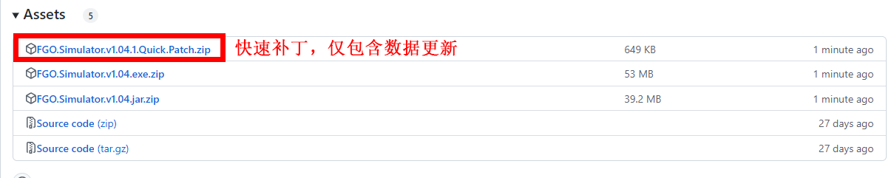
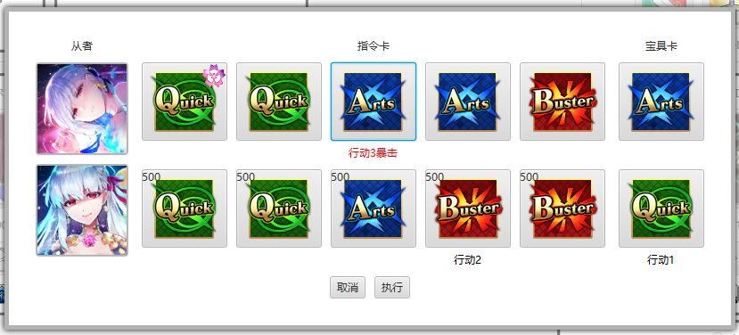
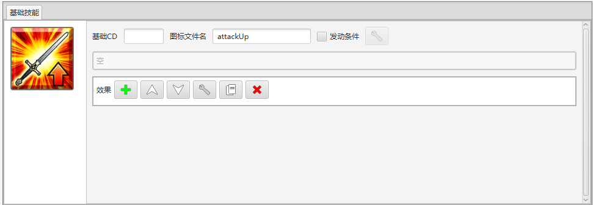

# FGO模拟器

未来大概就只在github随缘更新，但是现有的制作器基本支持写出绝大部分东西了。

Also, this simulator supports translations. If you are interested, you can put your translations under `Translations` folder. The language to use is currently manually configured in `options.ini`. Most of the string keys are direct descriptions, but you can still contact me via discord Yome#1561 for explanations if you are curious about what each key does.

另外是支持多语言的，有兴趣的在`Translations`文件夹下加就好。首选的语言可以在`options.ini`里设置。

目前支持的操作：

- [战斗模拟](#战斗模拟)
- [从者编辑器](#从者编辑器)
- [概念礼装编辑器](#概念礼装编辑器)
- [关卡编辑器](#关卡编辑器)
- [敌人编辑器](#敌人编辑器)
- [指令纹章编辑器](#指令纹章编辑器)
- [魔术礼装编辑器](#魔术礼装编辑器)

顺便这里是本模拟器的看板娘Sim娘（~~画出来很像BB所以当BB同人没准也行~~）：


## 使用说明

### 下载
在Release页面中下载当前版本的压缩包解压就好：[传送门](https://github.com/SharpnelXu/FGOSimulator/releases/tag/v1.05)

#### 注意
如果你的电脑安装了Java 15以上，可以直接下载标注为`.jar`的`zip`压缩包解压。

如果没有或者不确定的话，Windows用户可以尝试下载标注为`.exe`的`zip`压缩包解压。这个压缩包包含了程序需求的运行环境，所以会大一点。

当前版本：v1.05，数据版本：v1.05.0（更新至迦勒底妖精骑士杯 ～第二代的凯旋～）


### 更新

目前没有数据更新（v1.05.0），如果有之前的数据版本，可以直接下快速补丁，即标记为Quick Patch的zip文件然后在本地解压替换掉数据就好。



目前我已经更新完了我自己会用到的大多数功能，接下来就比较佛系了。

新从者的更新我倾向于使用者自己去更新，不过我自己也会跟进。目前的想法是打包数据包，可以从上面的传送门去对着版本号下载，然后解压缩替换掉本地的数据就好了。

### 运行
我用Java15（corretto 15.0.2）写的，所以应该装个Java15以上就能跑？

如果下载的是`.jar`压缩包，主程序在`Program`文件夹下，直接双击`FGOSimulator.jar`即可运行。我自己在Mac上测试的时候需要下个javafx sdk还要用console，可能还有地方没整好
```
java -p <path to javafx sdk>/lib  --add-modules=javafx.controls,javafx.graphics,javafx.base --add-opens javafx.graphics/com.sun.javafx.util=ALL-UNNAMED --add-opens javafx.base/com.sun.javafx.reflect=ALL-UNNAMED --add-opens javafx.base/com.sun.javafx.beans=ALL-UNNAMED -jar <path to jar>/FGOSimulator.jar
```

如果下载的是`.exe`压缩包，可以直接双击`FGOSimulator.exe`运行。目前`exe`版本仍在测试阶段，如果无法运行请联系我进行[反馈](#反馈)。

由于路径关系，主程序请不要随意挪到别的文件夹！另外`CommandCodes`, `CraftEssences`, `Enemies`, `Icons`, `Levels`, `MysticCodes`, `Servants`, 
`Translations`文件夹及各种默认图片也请不要随意挪动。

### 反馈

用于数据是手动录入，缺漏和错误肯定不在少数（我写个Readme都能瞅见好几个），虽然使用者可以自己本地改掉，但是也希望能反馈给我完善数据。

最直接的是去NGA找我：[传送门](https://ngabbs.com/read.php?tid=31985286)

或者加我QQ：695312637，反馈QQ群：302901428

当然如果你有什么建议的话也欢迎提出来，现在战斗界面还有不少空间放其它功能。

## 战斗模拟

**注意：** 在点击战斗模拟后可能会有卡顿，这是模拟器加载数据时的正常现象。换句话说，只有在进入战斗模拟界面的时候才会读取数据，
同时在加载完成后，其他模式保存、更改的数据**不会影响**已加载的数据。若要重新加载，请关闭战斗模拟界面并重新加载。

### 准备界面

准备界面算是借用了关卡编辑器，在这个界面加载关卡后可以正常编辑关卡进行更改或保存。
相关的详细内容参加[关卡编辑器](#关卡编辑器)，这里主要说明准备区域的构成。

#### 编队显示


- 点击`队伍`可以切换当前从者是否为助战。总Cost显示在右侧滑条下方，不过超过上限也并不会禁止模拟，仅作显示用。
- 点击按钮即可选择从者或礼装。
  - 从者的筛选功能会从所有录入的再临中进行选择，举例同时可以在枪阶红卡光炮和蓝卡单体的条件下见到妖兰。
  - 礼装目前没有特别的筛选功能，我自己只是把不用的从`CraftEssences`文件夹挪到了`Event CEs`。实际上确认不用直接把数据删了也可以。


- 编队显示头像下方的按钮作用分别为：
  - ：通过编辑器查从者或礼装的基础数据，注意这个状态下无法进行编辑和保存。
  - ：编辑从者的再临、等级等具体的设置。
  - ：将从者或礼装从编队中移除。
- 从者设置界面中，附加技能设置为0则为未开放。
- 指令纹章的格式为`commandCode<指令纹章编号>`，可以对照Mooncell或者`zh_CN.ini`中的翻译来找想要的纹章的编号。
不过要注意的是绝大部分纹章可能需要自己制作。
- 羁绊等级现在暂无实际用途。
- 点击开始模拟后，队伍中从者、礼装、御主装备的设置将会保存至`userPrefs.json`。
如果队伍中有同名从者/礼装，则保存最右边的从者/礼装的设置，但进入关卡时的设置还是各自的设置，只是保存时会选最右的保存。

### 战斗界面

战斗界面由从者显示、礼装及功能显示、敌方单位显示和战斗记录组成。

#### 从者显示


- 最上方的按钮代表该从者当前是否为选中状态。若为选中状态，则所有指向性的技能（目标友方）会自动以该从者为目标。
点击该按钮或是从者头像都会将该从者设置为选中状态。
- 从者技能使用后会显示CD。无法行动状态下则会显示X。
- ATK为补正前的数值，即游戏内显示的数值。为了节省空间，HP只会显示当前HP槽的血量，详细可以点击下方的放大镜图标查看。
- ：显示该职阶的基础数值，例如ATK补正、职阶克制等。
- ：显示该从者当前的详细状态，例如从者所持特性、各个状态的具体效果、持续时间等。
- ：通过从者编辑器查看该从者的基础数据。
- ：立刻刷新技能。
- ：为该从者添加一个回合结束时强制即死的状态，用于模拟敌方攻击。
- 最下方为当前该从者被赋予的所有状态。带框为不可解除的状态，通常是该从者的被动技能和礼装赋予的。

#### 礼装及功能显示


- ：通过魔术礼装编辑器查看魔术礼装的基础数据。
- 由于模拟器暴击不依赖暴击星，所以暴击星显示为计算得出的期望值，仅作参考。
- 场地特性列出的图标所代表的特性为：
  - ：燃烧
  - ：都市
  - ：森林
  - ：虚数空间
  - ：千年城
  - ：水边
  - ：阳光照射
  - ：其他，具体特性可以将鼠标移到场地特性图标上查看。
- 概率阈值和随机数可以随时调整，同时设置的数值会被撤销功能保存。
- ：显示指令卡选择界面。
  指令卡选择界面中点一下为选择，点两下则为暴击，这点和FGO Team-up一致。另外会显示指令纹章和指令卡强化的数值。


- ：全体友方从者NP增加100%。方便宝具释放。
- ：发动自定义效果。
这些效果和御主礼装一样没有明确的发动来源，所以使用时请将目标选择为“目标友方/敌方”、“全体友方/敌方”等合理目标。详细解说参见[编辑器说明](#编辑器说明)。
- ：撤销上个操作，包括技能使用、攻击和自定义效果。
选中的我方、敌方单位、概率阈值和随机数都会回退到上次操作前的选择。另外注意：由于
和会将所作用的从者为效果目标，所以会改变选中的我方单位，这会导致撤回时变更所选从者。
- 战斗记录等级分为三档，ACTION只会显示操作相关的记录，EFFECT会显示操作和效果记录，而DEBUG会显示全部记录。默认为EFFECT。

#### 敌方单位显示
基本与从者显示一致，值得一提的就是查看状态时拥有多管HP槽敌人的显示：


图中当前HP槽为1，也就是目前该单位显示的是第一管HP，即1000。

#### 战斗机制
- 敌方单位不会行动，但是仍会发动正常发动回合结束效果等类似操作。
敌方从者默认为一宝并拥有稀有度不喂圣杯所允许的最大等级的ATK，这点主要是为了正确执行敌方的巴姐反击buff。
- 虽然敌方从者会发动回合结束时获得暴击星的技能，但并不会真正获得暴击星。

## 编辑器说明

由于效果、状态、条件、数值变化关联紧密，建议看完这四个编辑器的说明再进行制作。

### 通用

- 按钮说明：
  - ：添加新项目，部分情况下会以当前显示或选中的项目为蓝本进行复制。
  - ：左移显示或选中的项目。
  - ：右移显示或选中的项目。
  - ：上移显示或选中的项目。
  - ：下移显示或选中的项目。
  - ：编辑当前显示或选中的项目。
  - ：复制当前显示或选中的项目至最末。
  - ：移除当前显示或选中的项目。
- 目标
    - 一个合理的目标是技能、状态、条件判断的基础。在战斗中有随时合理的目标，任何以这些为目标的效果和条件判断都应该正确结算：
      - 目标友方：只要模拟没结束， 模拟器就肯定有一个设定的目标友方。
      - 目标敌方：同上。
      - 非目标友方
      - 非目标敌方
      - 全体友方
      - 全体友方（包含替补）
      - 全体敌方：全体宝具应选取此项为目标。
      - 全体敌方（包含替补）
      - 首个敌方：从右向左数、从上到下数的第一个敌方单位。
      - 最后一个敌方
      - 全体角色
      - 全体角色（包含替补）
    - 目标的选择是相对的，也就是说从敌方的角度来讲敌方的全部友方对我方来说就是全体敌方。
    模拟中使用任意效果按钮发动的效果、场次效果、关卡效果是以我方视角为基准的。
    - 一些目标只有在发动效果后（包括攻击时，因为攻击也算效果）才能算是合理的目标，因为这些目标大多为相对应的：
      - 自身： 发动效果的单位。若是战斗中发动的任意效果或是场次效果以自身为目标则不会有任何效果（因为是无来源）。
      - 效果目标：如果效果有目标则为合理。由于处理效果时是依次处理，所以如果一个效果有多个目标，可以通过此目标来依次检测每个目标的条件。
      - 效果发动者：与自身相同，添加此项只是为了让像绘里濑的对死灵弱耐读起来合理（因为此时需要判断的时效果发动者的条件，写自身像是在指绘里濑）。
      - 除自身外全体友方
      - 除自身外全体友方（包含替补）
      - 除自身外第一个友方
      - 除自身外最后一个友方
      - 除自身外全体角色
      - 除自身外全体角色（包含替补）
      - 攻击者：只在处理指令卡和宝具伤害时合理。
      - 防御者：同上，注意全体宝具是依次处理伤害的，所以可以通过该目标选取当前处理的单位。
    - 注意以上这些目标中，效果目标、效果发动者、攻击者、防御者主要是用作条件判断。
    - 举例说明，比如“己方全体【龙】特性的友方单位NP改变20%”，此时效果目标为全体友方，而条件判断的目标为效果目标。
  
      

- 快速生成技能数值为基础值 + 每级加值 * 0 ~ 10 （9除外） 

  


### 从者编辑器


- 从者编号需要为整数，从者的ID为`servant<从者编号>`。
- 从者名字需填在`Translations/zh_CN.ini`的`Name`部分下，格式为`从者ID>=<名字>`。重启程序才会重新读取翻译文件。
- 从者特性请用逗号或顿号隔开。
- 特性可以直接复制Mooncell的数据（注意人型和EA特攻）。因为天地从者可以直接通过条件判断所以我没加天地从者这个特性，
  不过要注意亚从者和拟似从者。另外，特性的警告仅是警告，还是可以添加自定义特性的。
- 所有从者在战斗中会自动添加一个`从者`特性。
- 最下方的按钮作用如下：
  - 加载：从已有的从者中加载数据。 由于附加技能的高度重复性，在`Base Data`文件夹下可以找到准备的两个从者范本，可使用加载功能快速开始。 
  999适用于非Berserker的从者，1000适用于Berserker。
  - 保存：保存编辑好的数据，如果成功会显示`保存成功`字样。
- 保存的数据会以`<从者ID>.json`的格式保存在`Servants/<从者ID>/`文件夹下，从者的再临头像也放在同一文件夹内。
- 从者的再临头像格式为`<从者ID>_asc<再临阶段>_thumbnail.png`。


- 指令卡数据可以通过快速生成按钮将所填的数据复制给所有指令卡和宝具卡。


- 上方按钮作用为添加宝具强化。
- 宝具类型仅作筛选用，无实际效果，所以实际制作宝具效果时还是要正确选择目标。


- 上方按钮作用为添加技能强化。
- 图标文件放在`Icons/Skills/`文件夹下，使用时不用带上扩展名，默认为`png`格式。


- 被动技能和附加技能付与的状态不用勾选不可解除，会自动标记为不可解除。
- 从者数据格式为`{"lv":1,"HP":1652,"ATK":1775}, {"lv":2,"HP":1816,"ATK":1943}, ...`。
  这部分最好的获得方式是去Mooncell的`从者<从者编号>/成长曲线`的编辑页面摘取，`lv`无实际作用，只是因为这是Mooncell使用的格式（
  请不要随意更改Mooncell的资料）。感谢Mooncell！

### 效果编辑器


- 自定义概率主要用于付与状态、解除状态、即死、充能改变。若是不提供数据则为默认100。
- 若是只是想要标记概率为OC效果，不必勾选效果为OC效果。所有OC的勾选中只要勾了任意一个整个效果就会被正确处理。
- 特殊说明：
  - 付与状态：对于付与状态来说，如果数值只是根据等级变化的话，数值变化放在Buff里就好。
    这个界面唯一需要添加复数状态就是在OC时，每个OC对应一个状态（具体可参照已有的从者）。
  - 解除状态：数值填0以解除所有符合条件的状态。
  - 强制解除状态：用于解除不可解除的状态，不过仍然受状态解除耐性影响。
  - 充能改变：注意正负数。
  - 宝具伤害：目前无视生效条件一定生效。宝具伤害只有三个合理的目标：目标敌方、全体敌方、攻击者（来自巴姐宝具）。
    特攻条件的目标一般应设定为防御者。
  - 吸收状态：目标指的是从哪些单位吸取目标，最后总是吸到自己身上。
  - 选择指令卡：对应的状态应该只为指令卡类型变化和宝具指令卡类型变化。
  - 随机效果：需要提供至少一个可选项。实际操作时会要求使用者选择具体执行哪个效果。
- 举例说明：
  - 领导力10%~203T：付与全体友方攻击力变化10%~20%3T
  
    
  - 500%解除全体敌方攻击强化状态
  
    
  - 降低全体敌方攻击力20%\~40%3T随OC变化：（OC）付与全体敌方攻击力变化-20%\~-40%3T
  
    
  - 水院宝具：全体敌方宝具伤害450%~750%随等级提升，宝具特攻精神异常类状态随防御者精神异常类状态变化
  
    

### 状态（Buff）编辑器


- 生效回合数和生效次数都留空则为永久状态。
- 被动技能和礼装付与的状态不用勾选不可解除，会自动标记为不可解除。
- 强制为可叠加在实际数据中唯一用到的状态是毅力。
- 图标不会自动填充，需要手动填写`Icons/Buffs`中的一项（举例`attackUp`）。
- 自定义概率和生效条件作用于全部状态类型。
- 添加状态特性一栏，若不勾选则会使用状态类型默认的状态特性，但一旦勾选其中一项那么就只会使用勾选的状态特性。
  - 举例说明，攻击力变化默认设置为攻击类状态，并根据数值的正负决定是否为强化或是弱化状态。
  而若勾选了防御类状态和精神异常类状态，那么这个Buff就不具有攻击类状态，并且数值也不会影响这个Buff是强化或是弱化。
- 回合结束时效果等发动其它效果的Buff都**默认不具有**任何特性，所以需要手动添加。
- 一般而言，数值为正数的都默认为强化类状态，反之则是弱化类状态。例外是灼烧、诅咒等一定默认为弱化效果的Buff。
- 状态特性一般用来判断强化解除、弱化状态解除的目标，也可以通过添加自定义特性来实现特定状态的解除，可以参考奥伯龙。
- 填写数值时，注意是否为百分比Buff。基本上照着Mooncell上的填就没错，攻击+20%就写20。
- 特殊说明：
  - 指令卡性能提升：默认总是生效特定色卡需要填写对应的条件。 
  - 暴击发生率、被暴击发生率、受击NP率变化、目标集中度变化：由于敌方不会行动，这些Buff目前没效果。
  - 暴击星集中度、无法抽出指令卡、无貌之月、洗牌：由于行动自由选卡，这几项也没效果。
  - 强化无效、弱化无效：由被强化成功率-1000%和弱化耐性1000%分别实现强化无效和弱化无效。即死无效建议通过把即死耐性拉到10000%来实现。
  - 魅惑耐性下降：是精神异常类状态。
  - 从者技能的“攻击时发动效果”一般为攻击后效果，而指令纹章的一般是攻击前效果。
  - 延迟效果、回合开始时效果和回合结束时效果：延迟效果是经过特定回合数后在敌方回合结束时发动的效果，回合结束效果是在己方回合发动的效果。
  这些效果和眩晕、诅咒等Buff的发动顺序大致为：
    1. 我方回合开始
    2. 作用于我方的回合开始时效果
    3. 出卡，回合结束
    4. 结算作用于我方的封印类、行动不能类状态的持续时间
    5. 诅咒、灼烧、毒结算
    6. 作用于我方的回合结束时效果，此时有回血可以拉起上一步血量扣到0以下的单位
    7. 结算作用于我方的攻击类状态、回合结束时效果、诅咒、灼烧、毒的持续时间
    8. 作用于敌方的延迟效果
    9. 伤害反弹Buff（小安）
    10. 结算所有作用于敌方的上述以外的Buff的持续时间（如果是巴姐则全部结算）
    11. 敌方回合开始
    12. 作用于多血条的敌方单位的HP击破效果
    13. 敌我双方互换重复上述步骤a~j
  - 退场时效果和战败退场时效果：换人算退场，不算战败退场。
  - 移除特性：符合的特性即便有复数个也会移除所有。
  - 收到DoT伤害时HP最低剩余1：只作用于诅咒、灼烧或者毒。
  - 职阶相性变化：拆成了攻击相性和防御相性，若不设定自定义数值则为1.0。可以填写任意职阶（ANY_CLASS）来针对所有职阶。
  - 指令卡类型变化：Hits数也会变，所以需要从者有对应的色卡。如果是在选择指令卡效果下执行，此处所选的卡色会被实际选择覆盖，所以这里可以随便写一个。
  - 宝具指令卡类型变化：宝具倍率以BAQ比率1:1.5:2来转化。如果是在选择指令卡效果下执行，此处所选的卡色会被实际选择覆盖，所以这里可以随便写一个。
  - 技能阶级提升：实际效果为提升技能强化。
- 举例说明：
  - 手办娘三技能的Buff：回合结束时全体友方回1000~2000HP并解除弱化状态3T，视为强化类状态
  
    
  - 3T红放20%~30%

    

### 条件编辑器
技能和宝具可以有发动条件，效果和Buff也可以有生效条件，所以专门写了这一类来进行相关的判断。
大部分我觉得都还比较好懂？

- `boolean`相关条件：
  - 总是满足：默认的条件，相当于`true`
  - 从不满足：相当于`false`
  - 同时满足：相当于`&&`
  - 任一满足：相当于`||`
  - 不满足：相当于`!`

- 战斗相关条件：

  - 当前指令卡类型：红放蓝放绿放红爆蓝爆绿爆红耐性蓝耐性绿耐性等等，由于我肯定不会给每种攻击buff都写一个特定色卡所以色卡相关的都需要这个条件才能特定色卡生效。
  - 当前指令卡为宝具卡：“不满足：当前指令卡为宝具卡”相当于“当前指令卡为非宝具卡”。

- 状态相关条件：主要给付与状态和解除状态时的耐性判断提供条件。
  - 状态拥有特性：可以提供自定义特性，但主要用来判断强化、弱化状态。这里特性是单选，检测多个特性需要利用同时满足和任一满足。

- 目标具有状态：填一个用于判断状态的条件。
- 目标包含特性：在战斗中从者均会自动添加一个`从者`特性，以及属性、隐藏属性、性别为了方便也会被转为特性。
- 目标包含特定单位、从者装备礼装：填单位和礼装的ID。
- 举例说明：
  - 源赖光三技能的天地从者特攻条件判断

    

### 数值变化编辑器
部分效果和Buff拥有动态的数值变化，由于把这些逻辑放到效果和Buff里太复杂了我就单独写了一类来表示这些变化。
数值变化的具体值填在Buff那边，数值变化只决定如何变化。

- 根据状态数量变化：设定的目标中，每个符合条件的状态都会使数值变化。
- 根据特性数量变化：同上，但是针对特性。
- 根据可吸收HP变化：有多少吸多少，但不会致死。注意数值变化本身不会真的吸HP，所以还需要一个补一个效果来实际上吸掉。
- 根据可吸收NP变化：敌方充能槽里有充能才符合要求，我方则是有多少变多少。同上，并不会真的吸NP，只提供数值变化。
- 根据HP变化：HP在最大HP%以上时不会生效，在最大HP%和最小HP%区间逐渐提升，到最小HP%达到最大值。在区间内的具体公式为`基础值 + 附加值 * (最大HP% - 当前HP) / (最大HP% - 最小HP%)`
- 举例说明：
  - Lip的二技能按HP加攻

    
  - 梵高的一技能按诅咒数量吸加NP

    

### 概念礼装编辑器
### 指令纹章编辑器
### 魔术礼装编辑器

- 以上三个编辑器基本是从者编辑器的部分功能，需要注意的就只有储存的文件格式了。
  - 概念礼装类似于从者额外的被动技能。
  - 指令纹章类似于攻击时的额外Buff。
  - 魔术礼装类似于三个没有强化的无来源主动技能。
- 编号需要为整数。
  - 概念礼装的ID为`craftEssence<概念礼装编号>`。
  - 指令纹章的ID为`commandCode<指令纹章编号>`。
  - 魔术礼装的ID为`mysticCode<魔术礼装编号>`。
- 名字需填在`Translations/zh_CN.ini`的`Name`部分下，格式为`<ID>=<名字>`。重启程序才会重新读取翻译文件。
- 保存的数据会以`<ID>.json`的格式保存在对应的文件夹下，头像也放在同一文件夹内。
- 头像格式为`<ID>_thumbnail.png`，魔术礼装需要额外加`_male`和`_female`来区分咕哒夫和咕哒子。

#### 概念礼装注意事项：
- 由于概念礼装的等级数据基本都是一样的，在`Base Data`文件夹下可以找到准备的数据样本，这样制作礼装时不用去Mooncell的编辑页面。
- 概念礼装的发动者默认为穿戴其的从者，另外在付与状态时不需要勾选不可解除，会自动标记为不可解除。
- 概念礼装的效果须最多准备两级，分别为未满破，满破的效果，举例获得暴击星15，20，攻击力提升10，15。
- 活动倍卡推荐使用自定义场地特性来判断是否付与倍卡效果，可参考泳5的关卡和隐匿猎手。

#### 指令纹章注意事项：

- 指令纹章本质是一系列打在指令卡上的Buff，所以只有攻击类效果、攻击前后效果才有效。
- 指令纹章的Buff不会被减少使用次数，没有回合数限制，也不会被任何形式解除。

#### 魔术礼装注意事项：
- 男女服装图片是必要的，因为我没给准备默认的图片。
  格式为`<魔术礼装ID>_male.png`和`<魔术礼装ID>_female.png`。
- 魔术礼装本质就是三个无来源发动的主动技能，所以技能目标设置为自身是不符合逻辑的。

### 敌人编辑器


- 敌方单位也是支持基于所填写ID的翻译的，在`Translations/zh_CN.ini`的`Name`部分下，格式为`<敌人ID>=<名字>`。重启程序才会重新读取翻译文件。
  当然也可以直接填中文ID。
- 敌方单位具有根据职阶决定的基础NP补正，勾选死灵补正会使其变为1.2倍。
- 勾选自定义敌方NP补正会覆盖基础的敌方NP补正而转用所填的值。与死灵补正叠加。
  - 举例骑阶基础NP补正为1.1，勾选自定义补正填3则变为3，勾选死灵补正分别变为1.32和3.6。
- 任意职阶实际和盾阶一样的克制倍率。
- 特性请用逗号、顿号隔开。另外与从者特性一样可以添加自定义特性以满足需求。
- 支持敌方单位被动效果，会在模拟开始时释放。
- 举例说明：
  - 大型摩尔斯
  
  

### 关卡编辑器


- 按钮说明：
  - ：添加一个一般敌人。
  - ：添加一个从者作为敌人。
- 关卡名不支持翻译，俺直接开摆。
- 支持同屏三个以上敌人，并无设置上限，也就是说只要同屏幕最大人数填的够高可以一炮99杀。
- 场地特性请用逗号、顿号隔开。另外与从者特性一样可以添加自定义特性以满足需求。
- 支持场次和关卡效果，由无来源在我方视角发动。模拟开始时，先发动关卡效果，其次再发动场次效果。从者的入场先于这些效果的发动，但是入场时效果是在场次效果之后再发动的。


- 敌人没有添加空位的设置，但是应该不影响。
- 敌人支持多血条，用逗号隔开即可。
- 敌人的基础数据可以随意更改，用于切换小怪职阶、调整从者即死率、添加影从者特性等。
- 若改动了属性、特性或是被动效果，模拟将会完全忽略掉小怪、从者的原本的数据，只使用所填写的。
不过点编辑之后会自动填充现有的数据，所以只是提醒一下。
- 敌方从者默认为一宝并拥有稀有度不喂圣杯所允许的最大等级的ATK，这点主要是为了正确执行敌方的巴姐反击buff。
- 举例说明：
  - 泳装六期的倍卡效果，填一次反复加载这个关卡来编辑其它关卡就行
  
  
  - 尼禄祭铃鹿高难效果，写得我都麻了（当时我还没写破血条效果和回合开始效果，现在应该容易那么一点）

  

## 已知问题
### BUFF
* 帝王花增殖状态这种复数的可堆叠上限没写
* 无貌之月不会正确解除，这个我懒得写了
* 由于强化无效和弱化无效是用耐性实现的，复数的无效会同时被消耗，推荐使用自定义效果来手动补充

### 效果
* 帕西维尔宝具最后一个回复HP百分比最低的友方的效果未制作
* 解除成功后赋予状态类效果实际为先检测是否有满足要求的可解除状态，实际可能被解除耐性顶掉而不会解除

### 模拟
* 敌方从者（主要为巴姐服务）默认1宝+atk为所在稀有度最大等级的atk
* 巴姐被晕/宝具封印会攻击吗？

## 更新相关
- v1.05:
  - 系统：
    - 选择卡色从下拉菜单改为按钮
    - 取消特殊发动目标这一设置，原本的特殊目标现在只需要在效果编辑器内列出即可
    - 新增编队储存功能
  - 效果相关：
    - 新增宝具随机效果（尺芬奇）
    - 删除最大HP改变（并未删除Buff），其原本功能由付与状态继承。此改动应无实际效果除了读取旧数据时可能会报错
  - Buff相关：
    - 添加新Buff：移除特性
- v1.04:
  - 系统：
    - 调整了敌方数据读取逻辑，当有变动时不再将基础数据视为蓝本。这是为了修复无法将敌方设定改为空值（0、无性别、无属性等）的问题
    - 新增`exe`运行版本
  - 效果：
    - 修正移动至替补末位未正确移动至末位的问题
- v1.03:
  - 系统：
    - 修正了增加从者的附加技能会导致旧的从者设置出错而导致无法开始模拟的问题
  - Buff相关：
    - 宝具威力提升促进不再促进宝具威力下降状态
- v1.02:
  - ~~**重大更新**：添加了看板娘Sim娘~~
  - 系统：
    - 添加特性`瓦尔基里`
  - 条件相关
    - 修正了目标ID型条件再编辑无变动时可能无法正确处理同名从者的问题
  - 效果相关
    - 修正了变更再临阶段被撤销后再次使用无法正确重置被动技能的问题
- v1.01:
  - 系统
    - 修复了魔术礼装技能不减CD的Bug......
    - 添加特性`猪化无效`，`夏日模式的从者`
  - 效果相关
    - 付与Buff效果的固定检测更正为效果对象是否还存活（HP > 0、拥有下一血条或是有可使用的毅力）
    - 解除Buff效果现在固定检测对象是否还存活
  - Buff相关
    - 修正了改变职阶相性不显示条件等信息的问题
    - 修正了显示敌方Buff时如果Buff效果太长固定效果图标描边不贴合Buff图像的问题
- v1.00:
  - 系统：
    - 修复了从者设置界面HP强化显示为ATK强化的Bug
    - 七周年战斗更新（Quick Chain20星，三色Chain）
    - 添加特性`虞美人`、`千年城`
    - 添加状态`回合开始时效果`、`HP槽击破效果`
    - 添加条件`发动者充能数至少为`
    - 添加数值变化`根据目标数量变化`
    - 修正鞭尸Bug的触发
    - 敌方单位放完宝具的回合不会再增加充能
    - 支持为敌方添加被动效果和自定义敌方NP补正
    - 所有界面优化
- v0.61.beta:
  - 系统：
    - 修复了目标选择文字的Bug
    - 现在可以点击从者头像选择指向性技能目标和换人
  - 机制相关
    - 宝具封印时敌方不再增加充能
    - 修复了延长攻击技能回合（巴姐被动）会导致敌方Buff（巴姐站对面）过早消除的问题
  - Buff相关
    - 添加了HP回复量提供提升Buff，与HP回复量提升Buff乘算（已验证）
- v0.60.beta:
  - 系统：
    - 修复了稀有度检查不为整数的Bug
    - 更新了截止到BB圣杯战线的所有从者
  - 机制相关
    - 付与Buff现在会固定检测效果对象是否还存活（HP>0）
    - 修正了复仇的怨念默认为Debuff的Bug
    - 修正了无法行动状态下指令卡连携、宝具连携的判断（Credit：NGA用户InsufficientFunds，aikawaJunCY）
- v0.53.beta:
  - 系统：
    - 限制了战斗中详细状态显示单个状态的长度，不会再导致看不见回合数
    - 职阶相性Buff显示优化
    - 修复了0%即死率的敌人不被正确读取的Bug
    - 限制了战斗模拟界面初始的最大宽度
  - 机制相关
    - 修复了效果发动类Buff无法正确检测效果发动者相关条件的Bug
    - 扩大了攻击者的检测范围，主要用于在战败退场时效果可以指向攻击者
    - 现在场次效果优先于入场，主要用于正确给敌方上登场效果
    - 修复了敌方充能不会归零的Bug
- v0.52.beta:
  - 机制相关
    - 修复了宝具伤害不检测职阶相性Buff的Bug
  - Buff相关
    - 职阶相性Buff现在会正确检测条件（Beast IV人科、兽科用）
- v0.51.1.beta:
  - 现在所有文件都会以UTF-8编码进行交互
- v0.51.beta：
  - 系统：
    - 尝试修复翻译文件读取乱码问题，现在会以UTF-8编码读取
  - 机制相关
    - 修复了会检测防御力变化上限的问题，现在只检查下限（-100%）（Credit：NGA用户1248hks）
  - Buff相关
    - 不可叠加状态检测现在会忽略掉强制为可叠加的同类Buff（大公三技能）（Credit：NGA用户1248hks）
    - 毅力发动顺序调整为优先消耗可解除的最早施加的毅力，直至全部可解除的毅力消耗完了才消耗不可解除的毅力（也是从最早施加的开始消耗）（Credit：NGA用户1248hks）
    - 伤害反弹现在只在受到过伤害才发动，并且无视回避和无敌，也不再消耗防御者的回避和无敌（Credit：NGA用户1248hks）
  - 从者编辑
    - 添加了NP率和出星率的一键生成
  - 关卡编辑
    - 修复敌方从者如果设置了非初始灵基加载时再临切换选项不会选到设置的再临的Bug
    - 优化了敌方从者如果有编辑过基础信息后再切换再临选项的机制，现在会清除编辑过的设置
    
## 声明
本软件的代码部分由MIT许可证许可使用，开发理念仅为个人使用。软件所涉及的公司名称、商标、产品等均为其各自所有者的资产，仅供识别。
软件内使用的游戏图片、动画、音频、文本原文，仅用于更好地表现游戏资料，其版权属于 TYPE-MOON/FGO PROJECT。
填写从者使用的数据来自[Mooncell](https://fgo.wiki/w/%E9%A6%96%E9%A1%B5)和[Atlas Academy DB](https://apps.atlasacademy.io/db/JP/servants)。
设计灵感来自[FGO Teamup](https://lsq5i5j.github.io/fgo-teamup/#/)。
部分机制资料来源NGA FGO版：
- [[理论分析] Overkill真实判定原理——Overkill混乱判定产生的根本原因](https://ngabbs.com/read.php?tid=11479672)
- [[理论分析] 因浮点数度、取整时机导致的实际np获取与理论值不同的问题的分析、探究](https://ngabbs.com/read.php?tid=23028710&fav=04293015)
